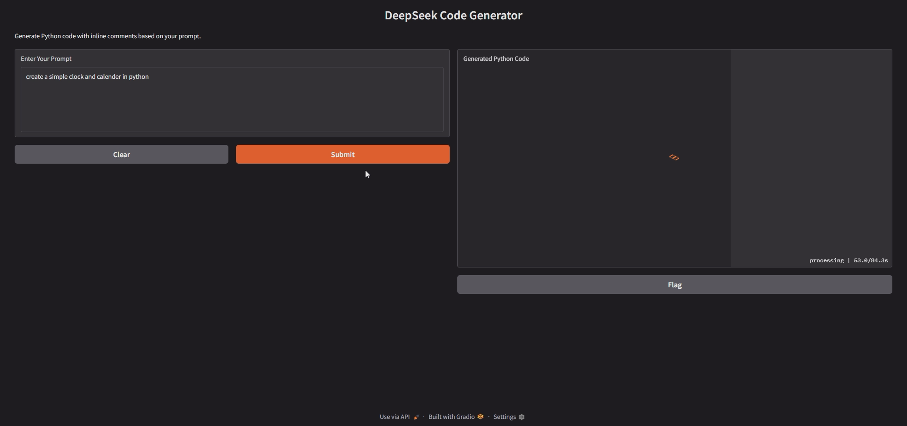

# DeepSeek Code Generator By Ammar Anwar 01047 (1M)

Generate Python code with inline comments from natural language prompts using the `deepseek-ai/deepseek-coder-1.3b-base` model with a Gradio interface or a Flask API.

## 🚀 Features

- Python code generation from natural language
- Uses DeepSeek Coder 1.3B model
- Gradio web interface for interaction
- Flask REST API for programmatic access
- CPU-based (can be modified for GPU)

## 📦 Requirements

- `Python 3.8+`
- `torch`
- `transformers`
- `gradio`
- `flask`

## 🛠 Installation

```bash
git clone https://github.com/Agent47c/DeepSeek_Code_Generator.git
cd DeepSeek_Code_Generator
pip install torch transformers gradio flask
```
## Set your Hugging Face token if required:
```bash
export HF_HOME="your_token_here"
```
## ▶️ Run the Gradio App
```bash
python App.py
```
## ▶️ Run Flask API
```bash
python Flask_Api.py

Once running, the API will be available at:

POST http://127.0.0.1:5000/generate
```

## 💡 Example Prompt
```bash
Write a Python function to calculate factorial using recursion with inline comments.
```
## Demo Screenshot

## Demo Video ( Click On The Image To Play Video )
[](https://drive.google.com/file/d/1FcBZtFWoNeZ7nV3HNYd0o0ymHYTpnUhB/view?usp=sharing)

## 📄 License
MIT License

## Acknowledgements

- [DeepSeek](https://huggingface.co/deepseek-ai)
- [Hugging Face Transformers](https://huggingface.co/docs/transformers)
- [Gradio](https://gradio.app)
- [Flask](https://flask.palletsprojects.com/en/stable/)
